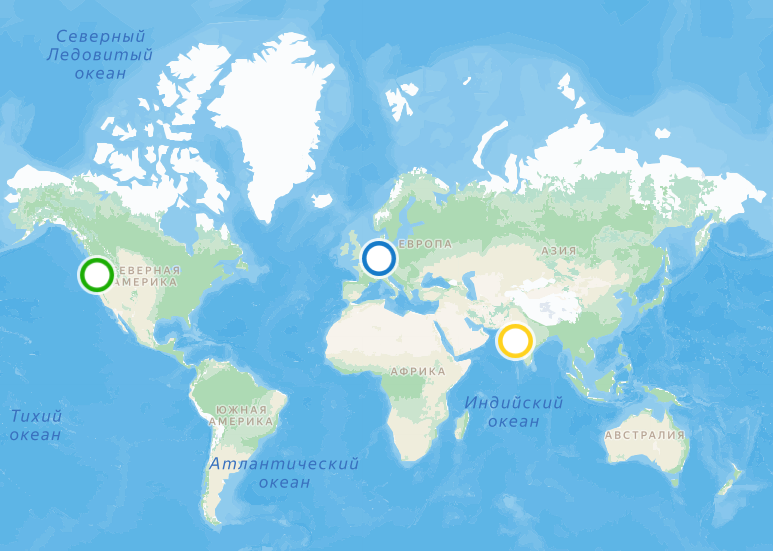
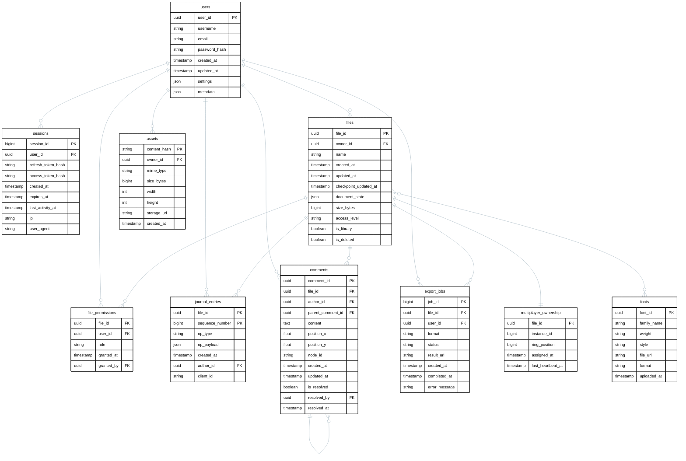

# Расчётно-пояснительная записка: VK Education High-load

## 1. Тема и целевая аудитория

[Figma](https://www.figma.com) - это один из самых популярных облачных графических редакторов, которым пользуются не только профессиональные дизайнеры, но и обычные пользователи. (В том числе я сам его использую для проектирования различных схем)

### Ключевой функционал

* Создание и редактрование объектов векторной графики
* Сохранение макета в облаке с выбором формата(PNG, JPEG, SVG, PDF)
* Просмотр сохранённого макета
* Совместная работа над одним макетом с видимостью курсоров
* Создание комментариев
* Регистрация пользователей
* Авторизация пользователей

### Ключевые продуктовые решения

* Совместная работа через WebSocket
* Передача полученных в ходе сессии изменений в макете, вместо полного документа

### Целевая аудитория

Согласно отчёту S-1[^1] , по состоянию на март 2025 года Figma имеет 13 млн активных пользователей в месяц и более 10 млн индивидуальных пользователей. Этим сервисом пользуется большое количество крупных компаний, среди них стоит отметить Microsoft, Airbnb, Github и Uber.

Основной аудиторией Figma являются дизайнеры, разработчик, продакт-менеджеры, исследователи и маркетологи. Большая часть клиентской базы находится в США - 38% и в Индии - 7%. Это говорит о том, что сервис активно используется по всему миру.

С точки зрения размеров организаций, основную долю пользовательской базы составляют компании с численностью сотрудников <50 человек - на них приходит 44% аудитории, на предприятия со штатом от 100 до 1000 сотрудников - 42%, а на крупные корпорации - 13%.

## 2. Расчёт нагрузки

К сожалению, Figma не предоставляет большинство необходимой для аналитики метрик информации в своих отчётах. Поэтому для большинства характеристик цифры были получены в качестве усреднения результатов схожих по сфере проектов на рынке и информации от дизайнеров пользовавшимся этим сервисом для реализации своих задач.

### Продуктовые метрики

#### Аудитория

Данные для рассчета DAU были получены за счёт того, что согласно аналитике Signals&Stories[^2]  проекты B2B SaaS в Северной Америке в среднем имеют показатель коэффициента удержания 31%, а в Азиатско-Тихоокеанском регионе - 33%. Согласно отчёту Figma и их заявлениям большинство пользователей сервиса пирходятся на США и на Индию. Поэтому в качестве значения DAU было выбрано число равное 4 млн пользователей.

>**Вычисление:** DAU = MAU × среднее(31%, 33%) = 13 млн × 32% = 4,16 млн ≈ 4 млн

| Метрика | Значение |
|---------|----------|
| MAU | 13 млн |
| DAU | 4 млн |
| MAU/DAU | 32% |

#### Данные

##### Файлы

Из общения с дизайнером, который имел стаж 2 года, было выяввлено, что в своей работе он использует более 100 файлов в Figma. В своём отчете компания заявила, что около 2/3 пользователей не является дизайнерами, а также одну треть от пользователей составляют разработчики. К сожалению, точно оценить количество файлов для разработчиков и остальных типов пользователей не удалось, поэтому воспользуемся очень условной оценкой: определённо разработчики создают кратно меньше файлов, по сравнению с дизайнерами, но при этом явно создают больше чем простые пользователи, так что предположим, что этот показатель можно оценить в диапазоне 15-20; по остальным типам пользователям практически невозможно сказать, поэтому возьмём условную оценку в 5-10 файлов. В итоге, предположив, что среднее количество файлов для всех дизайнеров будет равно 100, а остальный показатели будут соответствовать выдвинутым оценкам получим среднее число - 40-43 файла на пользователя. Учитывая неточность данных (и повышая количество файлов для большей нагруженности сервиса) возьмём в качестве среднего показателя 50.

> **Вычисление:** (100 × 1/3) + (17,5 × 1/3) + (7,5 × 1/3) = 33,3 + 5,8 + 2,5 ≈ 41,6 → 40–43 файла. Для нагрузки взято 50.

По поводу размера файлов не получилось получить точное число от дизайнера: "сложно оценить, так как файлов много и где-то лежит 1 объект, а где-то файл с дизайном для очень крупного события". В силу этого придётся отталкиваться только от информации о том, что максимальный размер файла составляет 2 ГБ и найденного исследования[^3], затрагивающего тему размера файлов. Из них было выявлено, что размеры варьируются от 28 до 41 МБ, но учитывая, что файлы в исследовании относились к дизайну приложений следует, что по всем пользователям оценка будет явно ниже: 10-30 МБ. Далее воспользуемся средней оценкой в 20 МБ.

В итоге получаем, что для пользователя средний размер всех фалов составляет приблизительно 1ГБ.

> **Вычисление:** 50 файлов × 20 МБ = 1000 МБ = 1 ГБ.

##### Журналы файлов

В Figma довольно сложная система хранения версий файлов, но для данного MVP воспользуемся упрощённой версией. Каждые 0.5 секунд система делает сохранение дельта-изменений в файле в журнал, а каждые 30 минут создаёт чекпоинт, который собирает все накопленные в журнале изменения и применяет их к прошлому чекпоинту. Тем самым, для каждого файла пользователя необходимо хранить дополнительную информацию о журнале изменений применённых после последнего чекпоинта. Согласно официальному блогу Figma[^4], инкрементальные изменения «на порядки меньше» полного файла. Учитывая, что за 30 минут может произойти максимум 3600 изменени, среди которых в стандартном случае работы лишь меньшая часть будет содержать реальные изменения, можно предположить, что средний размер журнала для файла будет составлять 1-3% от его размера. Точно оценить данный показатель без полноценных исследований просто невозможно, поэтому данное число было выбрано на основе логичных предположений.

> **Вычисление:** за 30 минут максимум 30 × 60 / 0,5 = 3600 записей. Реальных изменений - меньшая часть, поэтому журнал = 1–3% от файла. Для файла 20 МБ: 0,2–0,6 МБ. На пользователя (50 файлов): 50 × 0,4 МБ ≈ 0,02 ГБ.

##### Комментарии

Комментарии в Figma не хранятся внутри файла, а в отдельном месте, поэтому их стоит рассчитать как отдельный пункт. Со слов дизайнера в его команде не часто пользуется комментариями и он оставляет в среднем от 0 до 5 комментариев в неделю. С учётом того, что в среднем активных файлов будет 1-5, то есть в среднем 3, то за неделю будет получено около 1 комментария на файл. Учитывая, что по оценке дизайнера в среднем файл для дизайна активен в течении 3 месяцев, получаем что среднее количсевто комментариев - 13 на файл. Данная оценка ещё не учитывала оставшихся 2/3 пользователей. Разработчики определённо пользуются комментарии, по моему предположению настолько же активно как и дизайнеры, поэтому применим к ним ту же оценку. По остальным типам пользователей почтии ничего не известно, так что используя предложенное соотношения для файлов к комментариям получим, что они оставляют в среднем 1 комментарий на файл. В итоге среднее количество комментариев для пользователя - 1350/3 ~ 450 комментариев. Учитывая служебные поля комментариев и среднюю оценку длинны сообщения в 250 символов получим[^5], что их средний размер стоит ограничить 0,5 КБ. Таким образом, средний размер комментариев - 450*0,5=225КБ что меньше 0.001 ГБ.

> **Вычисление:** дизайнер: 0–5 комм/нед, при 3 активных файлах → ~1 комм/файл/нед. За 3 месяца (13 недель): 13 комм/файл. Дизайнеры: 650 комм/польз. Разработчики: 650 комм/польз. Остальные: 50 комм/польз. Средневзвешенное: (650 + 650 + 50) / 3 ≈ 450 комм/польз. Размер: 450 × 0,5 КБ = 225 КБ < 0,001 ГБ.

##### Пользовательские данные

Согласно  Privacy FAQ Figma[^6], в системе хранятся только метаданные профиля и служебная информация. Поэтому будем учитывать, что для пользователя будет достаточно хранить данный набор: имя профиля, email, хеш праоля, настройки и метаднные. Имя пользователя в среднем имеет размер 12 байт, а email - 23 байта[^7], для хранения хэша понадобится 64 байта (SHA-512). Для того чтобы сохранить эту информацию вместе с метаданными и настройками пользователя будет достаточно 1КБ.

##### Сводная таблица

| Тип данных | Средний размер(шт.) | Средний размер(ГБ) |
|---------|----------|----------|
| Файлы | 50 | 1 |
| Журналы файлов | 50 | 0.02 |
| Комментарии | 450 | <0.001 |
| Пользовательские данные | 1 | <0.001 |
| **Итого** | 551 | **~1,02** |

#### Картина пользователя

В итоге всех измерений была получена следующая картина пользователя Figma.

| Тип пользователя | Доля | Файлов на пользователя | Комментариев на файл | Комментариев на пользователя |
|------------------|------|------------------------|----------------------|------------------------------|
| Дизайнеры | 1/3 | 100 | 13 | 650 |
| Разработчики | 1/3 | 15–20 | 13 | 650 |
| Остальные | 1/3 | 5–10 | 1 | 50 |
| **Средневзвешенное** | **1** | **~50** | **~9** | **~450** |

#### Действия пользователей

* **Регистрация** - происходит 1 раз за всё время, так что таких запросов почти не будет.

* **Аутентификация** - по сути является отражением сессий пользователя, так что их количество можно оценить тем, сколько в среднем пользователи создают сессий в день. Согласно данному источнику для проектов типа B2B SaaS это число колеблется от 3 до 5[^8], так что возьмём среднее число - 4.

* **Открытие файла** - данное значение довольно сложно оценить, неизвестно, сколько различных файлов в течение одной сессии может открыть стандартный пользователь. Опираясь на предположенную выше информацию в 3 активных файла у пользователя, можем предположить, что за 1 сессию пользователь в среднем открывает 3 файла. Это значение очень условно и мало чем подтверждено, но получить конкретные цифры мне не удалось.

* **Создание и редактирование объектов** - это ещё более непредсказуемое и сложно оцениваемое значение. Дизайнеру было тяжело оценить это значение, получить информацию в интернете невозможно, значения этого показателя для других 2 типов пользователей ещё более туманны. Было найдено значение в 100000 вставок в месяц[^9], но количество сотрудников в компании неизвестно, и это только создание объектов, без учёта редактирования. Просто предлагаю взять число в 300–500 операций в день.

* **Записи в журнал** - согласно найденному блогу[^10] можно оценить, что дизайнер проводит в Figma в среднем по 4 часа в день, то есть максимум будет сделано примерно 30000 записей в журнал, но с учётом того, что оставшиеся 2/3 пользователей проводят меньше времени в системе, а также не всё это время в файле будут появляться изменения, уменьшим данный показатель до 4000–5000 запросов в день.

* **Сохранение изменений** - происходит каждые полчаса работы в файле, а также при закрытии сессии. Опираясь на оценку в 4 часа в день в Figma для дизайнера, получим, что он сделает в среднем 8+4=12 сохранений за день. Учитывая оставшиеся 2/3 пользователей, уменьшим эту оценку до 6–8 сохранений в день.

* **Синхронизация через WebSocket** - в официальном блоге Figma указано, что клиент при совместной работе отправляет сообщение раз в 33 мс. Опираясь на оценку в 4 часа в день для дизайнеров, получим, что должно отправиться около 436000 сообщений. Но, учитывая, что изменения не происходят большую часть времени, и многие запросы батчатся для оптимизации, эта оценка сильно завышена. Более логичное число - это 10% от этого показателя. Осталось учесть оставшиеся 2/3 пользователей - они уменьшат оценку до значения в 25000 запросов в день.

* **Создание комментариев** - воспользуемся теми числами, которые были указаны в расчёте количества комментариев для пользователя, оценка получилась довольно низкая - 0.5 запросов в день.

* **Просмотр комментариев** - это действие, в отличие от создания, происходит в разы чаще, поэтому стоит эту оценку поднять до 5 запросов в день. Коэффициент 10 был подобран вследствие следующей статьи[^11].

* **Экспорт файлов** - опираясь на слова дизайнера, данный функционал используется довольно редко, и в его случае применялся в среднем пару раз в неделю, что говорит о том, что таких запросов для среднего пользователя будет очень мало. Будем использовать значение 1/8, так как 2/3 пользователей будут пользоваться данной функцией реже, чем дизайнеры, и понизят оценку до 2/7 запросов в день.

##### Сводная таблица

| Тип действия | Запросов/день |
|--------------|---------------|
| Регистрация | 1 (за всё время) |
| Аутентификация | 4 |
| Открытие файла | 12 |
| Создание и редактирование объектов | 300–500 |
| Записи в журнал | 4000–5000 |
| Сохранение изменений | 6–8 |
| Синхронизация через WebSocket | 25000 |
| Создание комментариев | 0.5 |
| Просмотр комментариев | 5 |
| Экспорт файлов | 0.125 |
| **Итого (без учёта WebSocket)** | **~4 330–5 030** |

### Технические метрики
#### Хранение по типам данных

 Для того, чтобы рассчитать размер хранилища необходимо знать какое количество пользоваетелей имеет приложение. Figma не расскрывала эти данные ни в каких документах, поэтому лучшей оценкой, которую можно использовать будет MAU - 13 млн пользователей. Таким образом получим, что размер всех данных будет составлять около 13,3 ПБ, что вполне может отражать реальные показатели сервиса.

| Тип данных | Средний размер(шт.) | Средний размер |
|---------|----------|----------|
| Файлы | 650 млн | 13 ПБ |
| Журналы файлов | 650 млн | 0,26 ПБ |
| Комментарии | 5,85 млрд | 3 ТБ |
| Пользовательские данные | 13 млн | 13 ГБ |
| **Итого** | - | **~13,27 ПБ** |

##### Сетевой трафик

Для того, чтобы оценить сетевой трафик Figma необходимо рассчитать сколько в среднем будет весить каждый запрос для определённого типа действия.

* **Регистрация пользователя** - данное действие включает в себя отправку пользователем email, имени пользователя и пароля на сервер и ответ сервера с токеном и профилем. Учитываыя, что вся информация о пользователе входит в 1 КБ, а для отправки запросов потребуется установить соединение (типично 6453 байта[^12]) и проставить несколько дополнительных заголовков в запрос (типично 700-800 байт[^13]), можно оценить, что в среднем данное действие потребует около 8-9 КБ.

* **Аунтификация пользователя** - это действие почти идентично регистрации по своим показателям, так что размер такого запроса можно также оценить в 8-9 КБ

* **Открытие файла** - при открытии файла Figma загружает не весь документ целиком, а только его структуру: узлы, фреймы, слои, текст и журнал изменений. Изображения, шрифты и компоненты из библиотек не входят в этот запрос - они хранятся отдельно и подгружаются по мере необходимости. Поэтому размер операции уменьшается с 20,5 МБ до ~5,5–10,5 МБ.

* **Создание и редактирование объектов** - данная операция по сути представляет собой отображение на клиенте применённых изменения и не создаёт сетевого трафика.

* **Записи в журнал** - аналогично созданию и редактированию объектов, только происходит на стороне сервера и не создаёт сетевого трафика.

* **Сохранение изменений** - данное действие включает в себе применение изменений журнала к сохраненной версии фалйа и целиком происходит на сервере, так что не создаёт сетевого трафика.

* **Синхронищация через WebSocket** - при этой операции на сервер отправляется батч измененний, который произошёл на клиенте за короткий промежуток времени. Среди информации может также быть положение других пользователей в файле, но вместе с информацией о группе дельт они не будут занимать иного места, так как по сути будет список из преобразований в несколько байт и список координат с именами пользователей тоже на несколько байт. По итогу, с учётом оптимизаций формата данных можно взять оченку в 0,5-1 КБ на запрос.

* **Создание комментариев** - данная операция передаёт на сервер комментарий, длинна которого выше была оценена 250 символами в среднем, с заголовками на сервер. Используя оценки приведённые в других пунктах получим, что сообщение будет иметь размер около 1 КБ.

* **Просмотр комментариев** - для данного действия придётся получить от сервера все комментарии в файле. По оценкам, приведённым ранне получаем, что необходимо в среднем отправить 9 комментариев на файл. Учитывая метаданные комментариев, заголовки запроса и средний размер сообщения как при создании получаем, что для отравки потребуется 10 КБ.

* **Экспорт файлов** - эта опреация потребует скачивание файла в определённом формате по сети и именно оно будет составлять основную нагрузку. В качестве оценки среднего результат алгоритма сжатия файла, приименяющегося для конвертации данных возьмём 60%, что в итоге даёт 6-7 МБ на запрос.

Для получения итоговых результатов возьмём количество запросов по типу в день из прошлых оценок и DAU приложения. Домножим размер запроса на эти значения и получим следующие результаты, отражающие средний трафик в день по типам запроса:

> **Вычисление трафика/день:**
> - Регистрация: 4 млн × 8,5 КБ ≈ 34 ГБ
> - Аутентификация: 4 млн × 4 × 8,5 КБ ≈ 136 ГБ
> - Открытие файла: 4 млн × 12 × 10,4 МБ ≈ 499 ТБ
> - WebSocket: 4 млн × 25000 × 0,75 КБ ≈ 75 ТБ
> - Создание комментариев: 4 млн × 0,5 × 1 КБ ≈ 2 ГБ
> - Просмотр комментариев: 4 млн × 5 × 10 КБ ≈ 200 ГБ
> - Экспорт: 4 млн × 0,125 × 6,5 МБ ≈ 3,2 ТБ
> - **Итого: ~577 ТБ**

| Тип действия | Трафик/день |
|--------------|----------------------------|
| Регистрация | ~34 ГБ |
| Аутентификация | ~136 ГБ |
| Открытие файла | ~499 ТБ |
| Синхронизация через WebSocket | ~75 ТБ |
| Создание комментариев | ~2 ГБ |
| Просмотр комментариев | ~200 ГБ |
| Экспорт файлов | ~3,2 ТБ |
| **Итого** | **~577 ТБ** |

Чтобы оценить пиковую нагрузку на сеть необходимо получить распределение пользователей и оценить размер пиков с учётом их расположения. Figma нигде не гооврит о конкретных цифрах распределения пользователя но утвержлает, что большая часть аудитории приходится на США и Индию. Чтобы более точно оценить воспользуемся Similarweb[^14], источник не советовали использовать, но для этой цели, как мне кажется, подойдёт. Получаем следующую картину:

| Страна | Доля трафика | Пользователей (от 4 млн DAU) | Часовой пояс |
|--------|--------------|-------------------------------|--------------|
| США | 16,09% | ~644 тыс. | UTC−5 … UTC−8 |
| Индия | 10,76% | ~430 тыс. | UTC+5:30 |
| Россия | 8,08% | ~323 тыс. | UTC+3 … UTC+12 |
| Китай | 3,97% | ~159 тыс. | UTC+8 |
| ЕС | ~15-20% | ~600–800 тыс. | UTC+0 |
| Остальные | ~35–45% | ~1 400–1 800 тыс. | Разные |

Из данного распределения видно, что нагрузка в течении дня будет достаточно равномерной, так что крупных пиков не будет наблюдаться. Возьмём в качестве коэффициента для расчёта пиковой нагрзки 2, что можно взять исходя из данного исследования[^15], рассматривающего различные показатели приложения, использующегося по всему миру. Тогда разделив среднии показатели нагрузки в течении дня на его длину и умножив на коэффициент получим следующие результаты:

| Тип трафика | Средняя нагрузка (Гбит/с) | Пиковая нагрузка (Гбит/с) |
|-------------|---------------------------|---------------------------|
| Регистрация | ~0,003 | ~0,006 |
| Аутентификация | ~0,013 | ~0,026 |
| Открытие файла | ~46,2 | ~92,4 |
| Синхронизация через WebSocket | ~6,9 | ~13,8 |
| Создание комментариев | ~0,0002 | ~0,0004 |
| Просмотр комментариев | ~0,019 | ~0,038 |
| Экспорт файлов | ~0,3 | ~0,6 |
| **Итого** | **~53,4** | **~106,8** |

#### RPS запросов

RPS рассчитан как количество запросов в день на всех пользователях (4 млн DAU), делённое на 86 400 секунд. Пиковый RPS - умножением среднего на коэффициент 2, аналогично как для рассчёта пиковой нагрузки.

> **Вычисление RPS (средний):**
> - Регистрация: 4 млн × 1 / 86 400 ≈ 0,05
> - Аутентификация: 4 млн × 4 / 86 400 ≈ 185
> - Открытие файла: 4 млн × 12 / 86 400 ≈ 556
> - WebSocket (новые соединения): 4 млн × 4 / 86 400 ≈ 185
> - Создание комментариев: 4 млн × 0,5 / 86 400 ≈ 23
> - Просмотр комментариев: 4 млн × 5 / 86 400 ≈ 231
> - Экспорт файлов: 4 млн × 0,125 / 86 400 ≈ 6
> - **Итого: ~1 186 RPS (средний), ~2 372 RPS (пиковый)**

| Тип запроса | RPS (средний) | RPS (пиковый) |
|-------------|---------------|---------------|
| Регистрация | ~0,05 | ~0,1 |
| Аутентификация | ~185 | ~370 |
| Открытие файла | ~556 | ~1 112 |
| Синхронизация через WebSocket (новые соединения) | ~185 | ~370 |
| Создание комментариев | ~23 | ~46 |
| Просмотр комментариев | ~231 | ~462 |
| Экспорт файлов | ~6 | ~12 |
| **Итого** | **~1 186** | **~2 372** |

## 3. Глобальная балансировка нагрузки

Figma использует инфраструктуру Amazon Web Services (AWS) для размещения своих данных. Официально подтверждённые регионы для локального хостинга данных перечислены в документации Figma[^16].

| Регион | Основной дата-центр | Резервный дата-центр (Disaster Recovery) |
|--------|---------------------|------------------------------------------|
| США  | us-west-2 (Орегон) | us-east-1 (Вирджиния) |
| ЕС | eu-central-1 (Франкфурт) | eu-west-1 (Дублин) |
| Австралия | ap-southeast-2 (Сидней) | ap-southeast-4 (Мельбурн) |
| Индия | ap-south-1 (Мумбаи) | ap-south-2 (Хайдарабад) |
| Бразилия | sa-east-1 (Сан-Паулу) | - | 
| Япония | ap-northeast-1 (Токио) | ap-northeast-3 (Осака) |
| Канада | ca-central-1 | ca-west-1 | 

Для MVP боольшая часть из них не понадобится, поэтому остановимся на 3, которые будут покрывать основные рынки(США, Европа, Индия): 

| Дата-центр | Локация | Тип |Доля нагрузки |
|------------|---------|-----|--------------|
| США | us-west-2 (Орегон) | Дата-центр | ~35% |
| Европа | eu-central-1 (Франкфурт) | Дата-центр | ~35% |
| Индия | ap-south-1 (Мумбаи) | Дата-центр |~30% |
| Бразилия [ Избыточно ] | sa-east-1 (Сан-Паулу) | Промежутоынй узел | <1% |
| Австралия [ Избыточно ] | ap-southeast-2 (Сидней) | Промежутоынй узел | <1% |

### США - Орегон (us-west-2)
Дата-центр расположен на западном побережье США, в штате Орегон. Выбран потому, что США - крупнейший рынок по трафику (16,09%), а Орегон - зрелый регион AWS с четырьмя зонами доступности, что обеспечивает высокую отказоустойчивость внутри самого дата-центра. Помимо Северной Америки, этот дата-центр покрывает Южную Америку (Бразилия, Аргентина, Чили и др.) и часть Юго-Восточной Азии, не имеющих собственного дата-центра. Доля нагрузки - ~30%, так как США дают 16,09%, а остальное приходится на покрываемые регионы.

### Европа - Франкфурт (eu-central-1)
Дата-центр расположен в Германии, в городе Франкфурт. Выбран потому, что Европа - большой по значимости регион, а Франкфурт - основной хаб AWS в Европе с тремя зонами доступности. Помимо стран ЕС, этот дата-центр покрывает Россию, Ближний Восток (ОАЭ, Саудовская Аравия, Израиль) и Северную Африку. Доля нагрузки - ~35%, что соответствует сумме долей ЕС (15–20%), России (8,08%) и покрываемых регионов.

### Индия - Мумбаи (ap-south-1)
Дата-центр расположен на западном побережье Индии, в городе Мумбаи. Выбран потому, что Индия - второй по величине рынок Figma после США по активным пользователям, а Мумбаи - основной хаб AWS в Южной Азии с тремя зонами доступности. Помимо Индии, этот дата-центр покрывает Китай, Японию, Южную Корею, Юго-Восточную Азию (Сингапур, Индонезия, Вьетнам и др.) и Австралию. Доля нагрузки - ~35%, что соответствует сумме долей Индии (10,76%), Китая (3,97%) и покрываемых регионов.

### Бразилия - Сан-Паулу (sa-east-1) [ Избыточно ]
Промежуточный узел расположен на юго-востоке Бразилии, в городе Сан-Паулу. Выбран потому, что Бразилия - крупнейший рынок Южной Америки (за год здесь создано около 14 млн файлов). Сан-Паулу - основной хаб AWS в Южной Америке с тремя зонами доступности. Помимо Бразилии, этот дата-центр покрывает Аргентину, Чили, Уругвай, Парагвай и другие страны региона. Доля нагрузки для установки отдельного дата-центра слишком маленкая, так как абсолютное число пользователей в Южной Америке уступает США, Европе и Индии. Однако без локального узла совместная работа для бразильских пользователей будет работать плохо: задержка до ближайшего сервера в США составит 100–150 мс, что уже за пределами комфорта. Промежуточный в Сан-Паулу снижает её до 30–50 мс и обеспечивает приемлемое качество синхронизации.

### Австралия [ Избыточно ]
Промежуточный узел расположен на юго-востоке Австралии, в городе Сидней. Выбран потому, что Австралия - заметный рынок с активной базой пользователей, но по абсолютному числу пользователей уступает США, Европе, Индии и Бразилии, поэтому доля нагрузки для установки отдельного дата-центра слишком маленькая. Сидней - основной хаб AWS в регионе с тремя зонами доступности, узел покрывает Австралию и Новую Зеландию. Однако без локального узла совместная работа для австралийских пользователей будет работать плохо: задержка до ближайшего дата-центра в Мумбаи составит ~126 мс, а до США - 160–185 мс, что уже на грани комфорта. Промежуточный узел в Сиднее снижает её до 20-30 мс внутри страны и обеспечивает приемлемое качество синхронизации.

Для распределения пользователей между дата-центрами может использоватся latency-based routing в Amazon Route 53[^17] или просто Geo-DNS. Первый метод направляет запрос пользователя в тот регион, который обеспечивает наименьшую сетевую задержку, на основе измерений AWS между сетью пользователя и дата-центрами, но его пока не так часто используют крупнве компании. Второй метод уже давно проверен, им пользуется большое количество компаний, в том числе и сама Figma, и задержки к которым он может привести по сравнению с первым будут незначительны.

> **Отдельная информация по поводу работы latency-based** 
> Latency-based распределение работает на основе заранее собранной статистики, а не измерения задержки в момент запроса. Фоновые «пингеры» (LatencyProbe) постоянно зондируют целевые серверы из разных точек и замеряют RTT, привязывая результаты к группам DNS-резолверов. Эти данные формируют таблицу задержек, которая обновляется с заданным интервалом.
> Когда пользователь делает запрос, его браузер обращается к рекурсивному DNS-резолверу, а уже тот - к авторитетному DNS системы балансировки. Система видит IP-адрес резолвера, а не клиента, и ищет в таблице, какой сервер быстрее всего именно для этого резолвера (или для сети пользователя, если резолвер передаёт EDNS Client Subnet). На основе этой статистики система возвращает резолверу IP-адрес оптимального сервера, который тот передаёт пользователю.

## 4. Локальная балансировка нагрузки

Перед тем как проектировать систему локальной нагрузки была продумана схема, по которой будет осуществляться обработка основных типов взаимодействия пользователя и системы. Основной пункт касался того, как построить правильное совместное взаимодействие пользователей по WS с одним файлом. В качестве решения было принято использовать привязку файла к конкретному Multiplayer-инстансу через consistent hash по fileId: все клиенты, открывшие один файл, попадают на один и тот же инстанс, который держит состояние этого файла в памяти и рассылает операции всем подключённым клиентам. Это исключает split brain - ситуацию, когда разные инстансы независимо применяют операции к одной и той же копии файла и расходятся в состоянии. Было также рассмотрено решение через репликацию инстансов файла на все датацентры и поддержку синхронности через CRDT, но это очень тяжёлая задача и не требуется для такой системы (такое решение приняла и сама Figma). У такого подхода есть один минус, с которым придётся смириться, пользователи, которые находятся в отличном от расположения Multiplayer-инстанса регионе получат большую задержку[^18].

Далее для распределения локальной нагрузки нужно посмотреть как могут обрабатываться основные запросы сервиса:

* **Регистрация** - обрабатывается как обычный API-запрос, без привязки к файлу, любым API-инстансом.

* **Аутентификация** - обрабатывается так же, как регистрация: любой API-инстанс, без привязки к файлу.

* **Открытие файла** - обрабатывается как API-запрос любым API-инстансом (манифест читается из хранилища). Отдельно от этого клиент открывает WebSocket, который уже привязывается к конкретному Multiplayer-инстансу по fileId.

* **Создание и редактирование объектов** - отдельно не маршрутизируется, передаётся внутри WebSocket-канала.

* **Записи в журнал** - отдельно не маршрутизируется, выполняется на Multiplayer-инстансе, владеющем файлом.

* **Сохранение изменений** - отдельно не маршрутизируется, выполняется на Multiplayer-инстансе или фоновом воркере.

* **Синхронизация через WebSocket** - маршрутизируется строго по fileId через consistent hash на конкретный Multiplayer-инстанс. Соединение открывается при любом редактировании, независимо от числа пользователей.

* **Создание комментариев** - обрабатывается как API-запрос любым API-инстансом, без привязки к Multiplayer.

* **Просмотр комментариев** - обрабатывается как API-запрос любым API-инстансом, без привязки.

* **Экспорт файлов** - обрабатывается как API-запрос, выполняется асинхронно через очередь задач и воркер, результат кладётся в хранилище.

* **Внутренние запросы за статикой (шрифты, иконки, UI-ассеты, компоненты библиотек)** - маршрутизируются через CDN, без задействования L4 и L7. Сюда же относятся запросы за изображениями, загруженными пользователем: они тоже идут через CDN, origin - S3

Теперь можно ввести уже полноценное описание того, как можно организовать распределение локальной нагрузки. Общая схема строится на разделении трафика по трём маршрутам, каждый из которых обслуживается своим набором компонентов.

* **Первый маршрут** - статика и бинарные ассеты. Запросы за шрифтами, иконками, UI-ассетами, компонентами библиотек, а также за изображениями, загруженными пользователем, идут через CDN. Эти ресурсы вынесены на отдельное доменное имя, например static.figma.com, которое резолвится в адреса CDN. За счёт этого DNS ещё на этапе резолва отличает запрос за статикой от запросов к API или WebSocket и направляет его в нужный маршрут. Клиент обращается к DNS, получает адрес ближайшего edge-узла и забирает контент оттуда; origin'ом выступает S3, который нагружается только при cache miss. L4 и L7 в этом маршруте не задействованы, потому что ресурсы не требуют состояния и привязки.

* **Второй маршрут** - API-запросы. Путь запроса начинается с глобального DNS: он определяет ближайший к пользователю дата-центр и возвращает один виртуальный IP (VIP), за которым стоит пул L4-инстансов в этом дата-центре. Все L4-инстансы анонсируют этот VIP через BGP, а вышестоящий коммутатор строит ECMP-группу и распределяет входящие TCP-потоки между L4 по хешу от five-tuple. Это значит, что клиент всегда видит один адрес и не выбирает L4 сам, а распределение между L4 делает сеть. Если один L4 падает, он перестаёт анонсировать VIP, коммутатор убирает его из ECMP-группы, и трафик автоматически идёт на оставшиеся - без участия DNS и клиента.

Дальше L4 работает в режиме passthrough и распределяет TCP-соединения между L7-инстансами по алгоритму Least Connections: новое соединение идёт на тот L7, у которого сейчас меньше всего активных соединений. Это даёт более равномерную загрузку, чем Round Robin, потому что учитывает реальную текущую нагрузку на каждый L7. Выбранный L7 терминирует TLS и маршрутизирует запрос на любой API-инстанс - по Round Robin, так как API-инстансы stateless и все равнозначны. API-инстансы читают и пишут в общее хранилище, поэтому привязка к конкретному инстансу не нужна. Регистрация, аутентификация, открытие файла, комментарии и экспорт идут именно по этому маршруту. Экспорт при этом уходит в очередь задач и обрабатывается фоновым воркером асинхронно.

* **Третий маршрут** - WebSocket-соединения. Путь запроса также начинается с глобального DNS: он определяет ближайший дата-центр и возвращает тот же VIP, за которым стоит пул L4-инстансов в этом дата-центре. Распределение между L4 работает так же, как во втором маршруте: все L4 анонсируют VIP через BGP, коммутатор строит ECMP-группу и распределяет потоки по хешу от five-tuple. Клиент снова видит один адрес и не выбирает L4 сам.

Выбранный L4 по Least Connections распределяет соединение между L7-инстансами. Выбранный L7 терминирует TLS и применяет другую логику, чем для API: он извлекает fileId из URL, cookie или subprotocol, считает consistent hash и направляет соединение на конкретный Multiplayer-инстанс, который владеет этим файлом. Все клиенты одного файла попадают на один и тот же инстанс, что исключает split brain. Создание и редактирование объектов, записи в журнал и сохранение изменений отдельно не маршрутизируются - они происходят внутри этого WS-канала и на этом же инстансе.

#### Модификации для безопасности

Трафик между клиентом и L7 защищён TLS, который терминируется на L7. Трафик между L4 и L7 идёт внутри VPC, но для защиты от прослушивания внутри дата-центра его стоит закрыть mTLS: L4 предъявляет клиентский сертификат, L7 его проверяет. Это не требует изменения логики приложения и не нагружает L4 криптографией - L4 только инициирует соединение как клиент, а расшифровка и проверка сертификатов происходят на L7. Такой подход соответствует принципам Zero Trust и применяется в service mesh в проде.

#### Модификации для отказоустойчивости

Отказ Multiplayer-инстанса. L7 при маршрутизации WebSocket-соединения вместо одного конкретного инстанса возвращает клиенту список инстансов, владеющих файлом, - основной и один-два резервных, полученных из consistent hash-кольца. Клиент пытается подключиться к основному, и если тот не отвечает, переходит к следующему. Резервный инстанс подгружает последний checkpoint и journal из хранилища и продолжает обслуживать файл. Дополнительно L7 использует health-check'и: если основной инстанс не отвечает, он сразу направляет новые соединения на резервный.

Отказ L7-инстанса. L7 stateless относительно маршрутизации - consistent hash вычисляется детерминированно из fileId, поэтому потеря отдельного L7 не приводит к потере данных. L4 по Least Connections просто перестаёт направлять на него новые соединения, а клиенты переподключаются к оставшимся L7. Требование - одинаковое хеш-кольцо и одинаковый список Multiplayer-инстансов на всех L7.

Отказ L4-инстанса. Все L4 анонсируют VIP через BGP и входят в ECMP-группу. При падении одного L4 он перестаёт анонсировать VIP, коммутатор убирает его из группы, и трафик автоматически идёт на оставшиеся. L4 не хранит состояние, поэтому потеря инстанса не приводит к потере данных.

Отказ зоны целиком. Поскольку файл привязан к конкретному Multiplayer-инстансу в одном дата-центре, падение зоны означает, что все файлы, владельцы которых были в ней, становятся недоступны до восстановления дата-центра или переназначения владельцев на инстансы в других зонах. Резервные инстансы находятся в том же дата-центре, поэтому они спасают от отказа отдельного сервера, но не от отказа зоны. Эта проблема без потерь в других аспектах организации в сети не разрешима, так что с ней придётся смирится.

После того как определены роли уровней и требования к ним, нужно выбрать конкретные реализации. Для L4 был выбран AWS Network Load Balancer, для L7 - Envoy.

* **NLB:** Ключевое требование к L4 в этой схеме - держать долгоживущие TCP-соединения, не разрывая их, и при этом не тратить ресурсы на разбор содержимого. NLB работает на транспортном уровне и не парсит HTTP, поэтому его пропускная способность и задержка не зависят от сложности прикладного протокола. Его дефолтный idle timeout - 350 секунд, тогда как у ALB и HAProxy - 60 секунд: для WebSocket-сессий, которые могут жить часами, это принципиально.

* **Envoy:** Был выбран из-за того, что обновляет список Multiplayer-инстансов и позиции на хеш-кольце без перезапуска процесса и без разрыва уже установленных соединений. В схеме с consistent hash по fileId это важно: когда инстанс добавляется или падает, конфигурация на всех L7 должна обновиться синхронно, не порождая при этом новых процессов и не сбрасывая долгие WebSocket-сессии. HAProxy при изменении конфига требует перезагрузки, а старые процессы продолжают держать соединения, что создаёт операционную нагрузку и мешает быстрой сходимости. Дополнительно Envoy даёт ring hash для consistent hash по fileId и поддержку mTLS, что закрывает требования и по маршрутизации, и по безопасности между L4 и L7.

Резервирование на всех уровнях считается по формуле N+1, где N - число инстансов, необходимых для обработки пиковой нагрузки, а +1 - резервный инстанс на случай отказа одного из рабочих. Формула: N_total = N_required + 1, где N_required = ceil(пиковая нагрузка / пропускная способность одного инстанса).

#### Расчёт L4

Ограничители для L4 - пропускная способность и количество соединений. AWS не публикует фиксированную пропускную способность на «инстанс» NLB, потому что сервис автоматически масштабируется. Вместо этого используется модель LCU (Load Balancer Capacity Unit), где одна LCU эквивалентна 2,2 Мбит/с обработанного трафика .

Через L4 проходит трафик API и WebSocket: 92,4 + 13,8 = 106,2 Гбит/с. По пропускной способности требуется 106 200 / 2,2 ≈ 48 273 LCU. По умолчанию на одну зону доступности можно зарезервировать до 45 000 LCU[^19], поэтому одной зоны недостаточно - нагрузка распределяется на две зоны с запасом. С учётом резервирования по формуле N+1 требуется 3 зоны доступности с зарезервированными LCU в каждой. При трёх дата-центрах - 9 зон доступности суммарно.

#### Расчёт L7

Ограничители для L7 - SSL Termination и пропускная способность сети. По SSL Termination: один Envoy-инстанс на 8 vCPU выдерживает порядка 10 000–15 000 новых TLS-соединений в секунду и до 50 Гбит/с расшифрованного трафика[^20]. Возьмём консервативно 10 000 соединений/с и 25 Гбит/с на инстанс. По соединениям: пиковый RPS из раздела 2 - 2 372, это значительно меньше возможностей одного инстанса, поэтому по соединениям достаточно одного. По пропускной способности: 106,2 / 25 = 4,25, ceil = 5. N_required = max(1, 5) = 5. N_total = 5 + 1 = 6 L7-инстансов на дата-центр. С учётом трёх дата-центров - 18 L7-инстансов.

## 5. Логическая схема БД

> Потом схему переделаю в Figma

В даннной логической схеме используются следующие сущности:

- **users** - хранит профиль пользователя: имя, email, хеш пароля, настройки и метаданные. Необходима для аутентификации и авторизации. Информацию, которую тяжело представить одним полем (настройки и метаданные) были представлены в виде JSON-файлов. Пароль хранится в виде хеша, с зашифрованной внутри солью.

- **sessions** - хранит активные сессии и токены: refresh-токен, access-токен, время жизни, IP, user-agent. Нужна, чтобы не требовать повторного ввода пароля на каждый запрос и чтобы пользователь мог видеть и отзывать свои активные сессии. Сессия переживает перезапуск API-инстансов.

- **files** -  хранит метаданные файла (имя, владелец, размер, флаг библиотеки) и текущее состояние документа в поле `document_state` (дерево JSON). Это снапшот, который создаётся при процессе сохранении. Вместе с `journal_entries` используется для получения самого актуального состояние файла. Для того, чтобы добавить хранение историй изменений можно вынести отдельную сущность в виде checkpoint, но в рамках данного MVP я его не подразумевал (но могу добавить)

- **file_permissions** - матрица доступа к файлу, которая используется для определения, кто и с какой ролью (owner/editor/viewer) может работать с файлом. Такое решение было выбрано в связи с тем, что доступ к работе с файлом осуществляется не просто с помощью передачи ссылки, а благодаря приглашениям от владельца файла определённым пользователям.

- **journal_entries** - журнал изменений после последнего снапшота, хранящий последовательность операций (`op_type`, `op_payload`) в пределах одного файла. По нему файл доводится до актуального состояния при процессе синхронизации. `client_id` позволяет различать соединения одного пользователя и корректно обрабатывать переподключения и дедупликацию, а `author_id` показывает какой пользователь вносиил изменения.
 
- **comments** - комментарии к файлу: текст, автор, треды (через `parent_comment_id`), позиция на холсте (`position_x`, `position_y`, `node_id`), статус решения. Хранятся отдельно от дерева документа, опираясь на аналогичное продуктовое решение Figma, которое тоже не локализует комментарии вместе с файлом и они расположены в отдельных таблицах. 

- **assets** - метаданные загруженных изображений. Первичный ключ - хеш содержимого (`content_hash`), что даёт дедупликацию: одна картинка хранится один раз, независимо от того, кто её загрузил. Сами бинарные данные лежат в S3, в БД только метаданные и ссылка. Связь с файлами - через ссылки внутри `document_state`, а не через отдельную таблицу, потому что ассет - глобальный ресурс, а не часть файла.

- **fonts** - метаданные загруженных шрифтов: family, weight, style, формат, ссылка на файл.

- **multiplayer_ownership** - реестр владения файлами Multiplayer-инстансами. Хранит `file_id`, `instance_id`, `ring_position` и `last_heartbeat_at`. Используется для управления записями: гарантирует, что в журнал пишет только один инстанс, даже если при ребалансировке или сбое два инстанса одновременно решили, что владеют файлом. Это защита от split brain на уровне персистентного хранилища.

- **export_jobs** - очередь задач на экспорт файлов. Хранит `file_id`, `user_id`, формат (PNG/JPEG/SVG/PDF), статус, ссылку на результат и время. В теории можеь пригдится если мы хотим клиентом отслеживать статус работы эккспорта, но возмоно стоит её спилить.

Отдельно стоит сказать, что не вынесено в сущности. Геометрические примитивы, стили, текст, пути, компоненты, переменные, связи, реакции и plugin data - всё это внутри `document_state` в `files`, потому что документ - это иерархическое дерево, а не набор нормализованных строк. Вынос их в отдельные таблицы ломает атомарность снапшота и усложняет синхронизацию через журнал. Библиотеки - это файлы с флагом `is_library`, отдельная таблица не нужна. 

### Список источников

[^1]: [Figma, Inc. Registration Statement on Form S-1, filed with the SEC on July 1, 2025.](https://www.sec.gov/Archives/edgar/data/1579878/000162828025033742/figma-sx1.html)
[^2]: [Monthly active users (MAU): Definition, formula, and 2026 benchmarks](https://mixpanel.com/blog/mau/)
[^3]: [Benchmark Figma: 4 метода компонентов - сравнение](https://kyady.com/ru/blog/figma-component-performance-benchmark)
[^4]: [Figma: Building Multiplayer Infrastructure for Real-Time Design Collaboration](https://github.com/sujeet-pro/sujeet.pro/blob/main/content/articles/figma-multiplayer-infrastructure/README.md#3)
[^5]: [Публикация одного из активных пользователей Figma](https://www.linkedin.com/posts/darjanhren_i-exported-every-figma-comment-i-have-written-activity-7490655671139328000-TOs_)
[^6]: [Privacy FAQ - Figma Platform](https://static.figma.com/uploads/2ddcdb892cd3482b4ed1d1f200c518729af5bc19.pdf#1#1)
[^7]: [Статья на тему средних размеров пользовательских данных](https://web.archive.org/web/20130710170052/http://www.eph.co.uk/resources/email-address-length-faq/)
[^8]: [Статья на тему количества сессий пользователей](https://www.ideaplan.io/metrics/sessions-per-user)
[^9]: [Статья на тему количества созданных объектов](https://ds.mihailshamin.ru/06_economy/ds-101-measure-roi.pdf#1#1)
[^10]: [Блог дизайнера, пользующегося Figma](https://euleinstitute.com/en/blog/day-in-the-life-ux-designer/#next-steps)
[^11]: [Правило 1%](https://en.wikipedia.org/w/index.php?title=1%25_rule&useskin=minerva#1)
[^12]: [TLS ABBREVIATED SESSION IDENTIFIER PROTOCOL](https://patentimages.storage.googleapis.com/1c/d1/dd/e27fa01f82c784/EP2850776B1.pdf#5#2)
[^13]: [Google's SPDY research project whitepaper](http://dev.chromium.org/spdy/spdy-whitepaper)
[^14]: [Распределение аудитории Figma](https://www.similarweb.com/ru/website/figma.com/#geography)
[^15]: [Исследование на тему RPS](https://users.cms.caltech.edu/~adamw/papers/netcalc.pdf#5#4)
[^16]: [Документация Figma по дата-центра](https://help.figma.com/hc/en-us/articles/15643274574871-Enable-localized-file-hosting)
[^17]: [Документация по latency-based routing](https://docs.amazonaws.cn/en_us/Route53/latest/DeveloperGuide/routing-policy-latency.html)
[^18]: [Ну что сказать, потерпят...]
[^19]: [Статья с показателями NLB для рассчёта](https://pages.awscloud.com/rs/112-TZM-766/images/2025-03-18_SaaS-Builders_Cost-Allocation.pdf#2#2)
[^20]: [Статья с показателями Envoy для рассчёта](https://oneuptime.com/blog/post/2026-02-24-how-to-calculate-sidecar-cpu-requirements-for-istio/view)